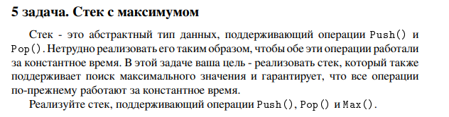

# Задание №5 : `Стек с максимумом`

Студент ИТМО, Ступичев Михаил Николаевич | 467614

## Вариант №21

## Задание 
 

## Input / Output 

| Input                                     | Output |
|-------------------------------------------|--------|
| push 2<br/>push 1<br/>max<br/>pop<br/>max | 2 2    |


## Ограничения по времени и памяти

- Ограничение по времени. 5сек.
- Ограничение по памяти. 512 мб.


## Запуск задания
1. Клонируйте репозиторий:
   ```bash
   git clone https://github.com/mnstupichev/algorithm_and_data_structures.git
   ```
2. Перейдите в папку с заданием:
   ```bash
   cd lab4/task5
   ```
3. Запустите программу:
   ```bash
   python src/solution.py
   ```

4. Запуск тестов:
   ```bash
   python pytest tests/
   ```