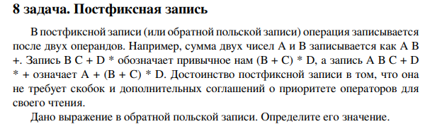

# Задание №8 : `Постфиксная запись`

Студент ИТМО, Ступичев Михаил Николаевич | 467614

## Вариант №21

## Задание



## Input / Output

| Input         | Output |
|---------------|--------|
| 8 9 + 1 7 - * | -102   |

## Ограничения по времени и памяти

- Ограничение по времени. 2сек.
- Ограничение по памяти. 256 мб.

## Запуск задания

1. Клонируйте репозиторий:
   ```bash
   git clone https://github.com/mnstupichev/algorithm_and_data_structures.git
   ```
2. Перейдите в папку с заданием:
   ```bash
   cd lab4/task8
   ```
3. Запустите программу:
   ```bash
   python src/solution.py
   ```

4. Запуск тестов:
   ```bash
   python pytest tests/
   ```