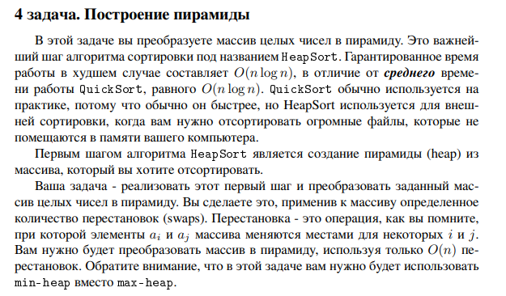

# Задание №4 : `Построение пирамиды`

Студент ИТМО, Ступичев Михаил Николаевич | 467614

## Вариант №21

## Задание



## Input / Output

| Input     | Output                    |
|-----------|---------------------------|
| 5 4 3 2 1 | 3<br/>1 4<br/>0 1<br/>1 3 |

## Ограничения по времени и памяти

- Ограничение по времени. 3сек.
- Ограничение по памяти. 512 мб.

## Запуск задания

1. Клонируйте репозиторий:
   ```bash
   git clone https://github.com/mnstupichev/algorithm_and_data_structures.git
   ```
2. Перейдите в папку с заданием:
   ```bash
   cd lab5/task4
   ```
3. Запустите программу:
   ```bash
   python src/solution.py
   ```

4. Запуск тестов:
   ```bash
   python pytest tests/
   ```