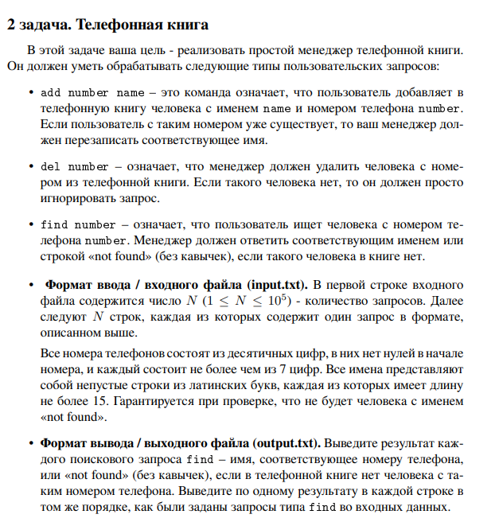

# Задание №2 : `Телефонная книга`

Студент ИТМО, Ступичев Михаил Николаевич | 467614

## Вариант №21

## Задание



## Input / Output

| Input                                                                                                                                                                              | Output                                                       |
|------------------------------------------------------------------------------------------------------------------------------------------------------------------------------------|--------------------------------------------------------------|
| add 911 police<br/>add 76213 Mom<br/>add 17239 Bob<br/>find 76213<br/>find 910<br/>find 911<br/>del 910<br/>del 911<br/>find 911<br/>find 76213<br/>add 76213 daddy<br/>find 76213 | Mom<br/>not found<br/>police<br/>not found<br/>Mom<br/>daddy |

## Ограничения по времени и памяти

- Ограничение по времени. 6 сек.
- Ограничение по памяти. 512 мб.

## Запуск задания

1. Клонируйте репозиторий:
   ```bash
   git clone https://github.com/mnstupichev/algorithm_and_data_structures.git
   ```
2. Перейдите в папку с заданием:
   ```bash
   cd lab6/task2
   ```
3. Запустите программу:
   ```bash
   python src/solution.py
   ```

4. Запуск тестов:
   ```bash
   python pytest tests/
   ```